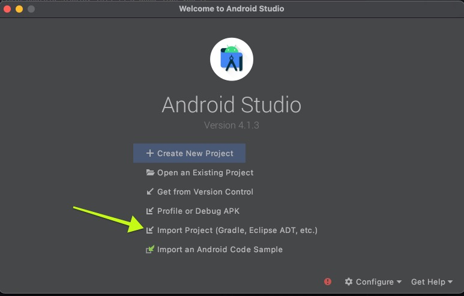
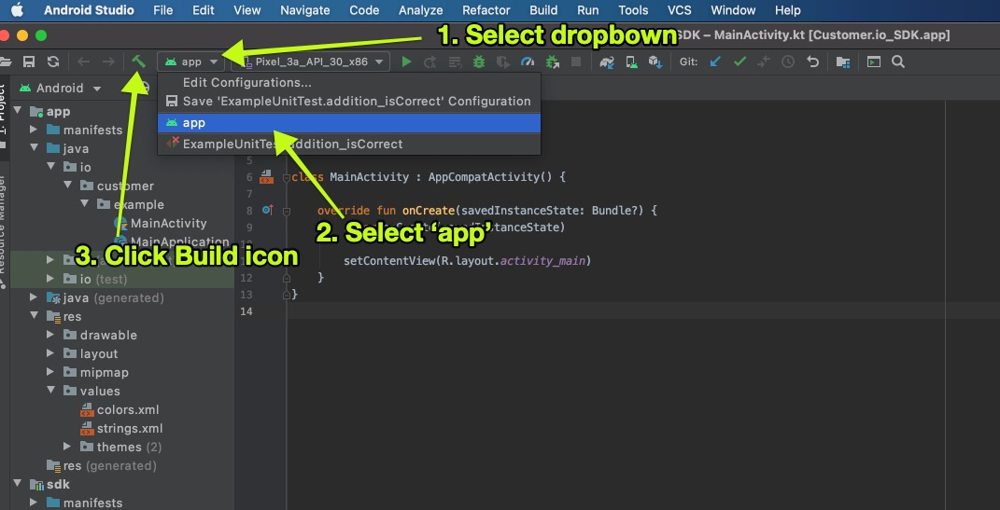

# Customer.io Android SDK

Official Customer.io SDK for Android

# Why use the Customer.io SDK?

* [X] Official SDK from Customer.io for Android. 
* [X] Written in Kotlin, for Kotlin (with Java support).
* [X] Javadoc + source code packaged in SDK. View Javadoc and source code easily in Android Studio while you develop!
* [X] Zero dependencies. Nice and slim for fast build times.
* [X] Deployments often. No need to wait for the next release of the SDK when something you need is added.

# Getting started

To use the SDK in your Android project....

1. In your root level `build.gradle` file, add the following:

```groovy
allprojects {
    repositories {
        google()
        jcenter()
        maven {
            name = "GitHubPackages"
            url = uri("https://maven.pkg.github.com/customerio/customerio-android")
            credentials {
                username = project.findProperty("githubRepo.username") ?: System.getenv("GITHUB_REPO_USERNAME")
                password = project.findProperty("githubRepo.token") ?: System.getenv("GITHUB_REPO_TOKEN")
            }
        }
    }
}
```

2. Create a new file in the root level of your project, `secrets.properties`. Inside, put:

```
githubRepo.username="<github-username>"
githubRepo.token="<github-token>"
```

*Note: You will need to create a new GitHub personal access token that has access to private repos scope. Make sure your GitHub account has read access to the SDK's GitHub repo. Then, replace `<github-username>` with your GitHub username and `<github-token>` with the access token you just created.*

> Important: Add `secrets.properties` to your `.gitignore` to not check the file into version control. 

3. Add your dependency to your app's `build.gradle` file:

```groovy
implementation 'io.customer.android:sdk:<version-here>'
```

Replace `version-here` with the [latest version published](https://github.com/customerio/customerio-android/packages/754003/versions).

# Documentation

//

# Contributing

Thank you for your interest in wanting to contribute to the project! Let's get your development environment setup so you can get developing.

Follow each section below to get the code running successfully on your machine. 

### Building 

Let's get the code compiling successfully on your machine. 

*Note: It's assumed that you have [Android Studio](https://developer.android.com/studio/) installed on your machine before continuing*

1. Clone the git repo to your computer.
2. Open Android Studio > Select "Import Project (Gradle...)" > then choose the root directory of the code (you will see `app/` and `sdk/` directories). 



3. Android Studio should walk you through installing the correct Android SDK for the code base. 

If all went well, you should be able to build the Example app within Android Studio. This is a good sign you're setup correctly.



### Development environment 

Now that you have gotten the app to successfully compile, it's time for you to finish setting up the rest of your development environment. 

* Setup git hooks to lint your code for you:

```
$ ./hooks/autohook.sh install
[Autohook] Scripts installed into .git/hooks
```

* Install `ktlint` Kotlin linting CLI tool. The easiest way is `brew install ktlint` but if you are not on a Mac, [find another way to install](https://ktlint.github.io/#getting-started) on your machine. 

### Development workflow 

Let's say that you make changes to this project and you want your changes to become part of the project. This is the workflow that we follow to make that happen:

1. Make a new git branch where your changes will occur. 
2. Perform your changes on this branch. This part is very important. It's important that your git branches are focused with 1 goal in mind. 

Let's say that you decide to do all of this work under 1 git branch:
* Add a new feature to the app. 
* Fix a few bugs. 

....this is an anti-pattern in this repository. Instead...

* Make 1 git branch for your new feature that you add to the app. 
* Make 1 git branch for each bug that you fix. 

*Note: If you fix a bug or add a feature that it requires you edit the documentation, it's suggested to make all documentation changes in the git branch for that bug or feature. Not recommended to make separate branches just for documentation changes.*

Why do we do it this way? 
* It makes our git commit history cleaner. When you think to yourself, "Oh, what was that change I made 3 months ago?" you can more easily find those commits because they are focused. 
* It helps the team deploy the code more easily to customers. 
* It makes code reviews much easier as pull requests are now more focused. 
* It is easier to find what commits break code. When we make small pull requests, we are able to isolate those changes from each other and more easily find what changes cause what issues. 

3. Make a pull request. 

When you make a pull request, a team member will merge it for you after...
* All automated tests pass. If they don't it's your responsibility to fix them. 
* A team member will review your code. If they have suggestions on how to fix it, you can discuss the suggestions as a team and/or make changes to your code from those suggestions. 
* Make sure the title of the pull request follows the [conventional commit message](https://gist.github.com/levibostian/71afa00ddc69688afebb215faab48fd7) specification. 

### Deployment 

This project is setup to automatically deploy when a commit is made on any of the branches: `main`, `beta`, and `alpha`. 

To setup the CI server to make the deployments, follow these steps:
1. Create a GitHub token on your personal GitHub account. As long as your account has push access to the SDK source code repository on GitHub. The scopes need to (1) read packages, (2) write packages, (3) private repos. 

Create GitHub Actions secrets: 
* `REPO_PUSH_TOKEN` - set the value to the GitHub token created in this step. This is used to push commits made on the CI server back to the source code repo after deployment. 
* `GRADLE_PUBLISH_USERNAME` - set the value to the GitHub username of the GitHub access token created. 
* `GRADLE_PUBLISH_PASSWORD` - set the value to the GitHub token created in this step. 

2. Follow the development workflow as described in this document. You will be making pull requests and once those are merged, the CI server will automatically execute and deploy for you. 

# License

[MIT](LICENSE)