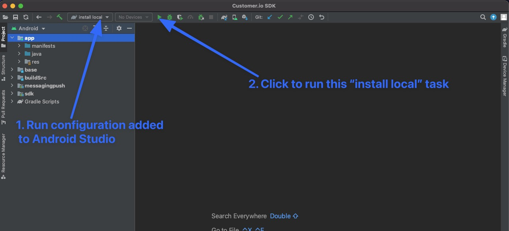

# Development Getting Started 

### Development getting started

Let's get the code compiling successfully on your machine. 

*Note: It's assumed that you have [Android Studio](https://developer.android.com/studio/) installed on your machine before continuing*

1. Clone the git repo to your computer.
2. Open Android Studio > Select "Import Project (Gradle...)" > then choose the root directory of the code (you will see `app/` and `sdk/` directories). 


3. Android Studio should walk you through installing the correct Android SDK for the code base. 

If all went well, you should be able to build the Example app within Android Studio. This is a good sign you're setup correctly.


### Development environment 

Now that you have gotten the app to successfully compile, it's time for you to finish setting up the rest of your development environment. 

* Setup git hooks to lint your code for you:

```
$ ./hooks/autohook.sh install
[Autohook] Scripts installed into .git/hooks
```

* Install `ktlint` Kotlin linting CLI tool. The easiest way is `brew install ktlint` but if you are not on a Mac, [find another way to install](https://ktlint.github.io/#getting-started) on your machine. 

### Development workflow 

See file [GIT-WORKFLOW](GIT-WORKFLOW.md) to learn about the workflow that this project uses. 

# Work on Remote Habits locally 

We use the [Remote Habits](https://github.com/customerio/RemoteHabits-Android) Android app to test the SDK in a real-world environment. 

When you install dependencies via grade in an Android app, gradle will look at various servers to download all of your dependencies. It would be a pain if every time that you made an edit to the SDK on your local machine, you would need to push the SDK code to a remote server so that gradle in Remote Habits could download it. 

To make this easier, your local machine can act as a server that gradle looks for dependencies with. Open this SDK project in Android Studio. When you open it, you should see an Android Studio run configuration called `install local`. Run this configuration:



> Note: `install local` in Android Studio simply runs the command: `IS_DEVELOPMENT="true" ./gradlew publishToMavenLocal`. You can run that command from your command line if you wish to instead. 

After this task runs successfully, if you look in the `~/.m2/repository/io/customer/android/` directory on your local machine, you will see some directories and files. The `~/.m2/` directory is a server that gradle can use on your computer to download dependencies from!

> Note: Every time that you make an edit to the SDK code, you need to run `install local` and then rebuild the Remote Habits app. 

That is all you need to do on the SDK side. Next, view the [Remote Habits docs](https://github.com/customerio/RemoteHabits-Android/blob/main/docs/dev-notes/DEVELOPMENT.md#work-on-sdk-locally) for next steps on getting Remote Habits to install the SDK from your local machine's `~/.m2/` directory. 

### Deployment 

See file [GIT-WORKFLOW](GIT-WORKFLOW.md) to learn about how code is deployed in this project. 

#### Deployment setup 

To setup the CI server to make the deployments, follow these steps:
1. Create a GitHub token on your personal GitHub account. As long as your account has push access to the SDK source code repository on GitHub. The scopes need to (1) public repos to write to repos. 

Create GitHub Actions secrets: 
* `REPO_PUSH_TOKEN` - set the value to the GitHub token created in this step. This is used to push commits made on the CI server back to the source code repo after deployment. 
* `GRADLE_PUBLISH_USERNAME` - set the value to Sonatype Jira username to push to Sonatype repository. 
* `GRADLE_PUBLISH_PASSWORD` - set the value to Sonatype Jira password. 
* `GRADLE_SIGNING_KEYID` - The signing plugin says "The public key ID (The last 8 symbols of the keyId. You can use gpg -K to get it)." The important part there is the last 8 characters of the keyid. Use command `gpg --list-secret-keys --keyid-format long` and the last 8 characters of the `[S]` subkey's keyId is the value of this environment variable. So if the key is woijeyrinvnno22o2n, you will set nno22o2n as the value on your CI server.
* `GRADLE_SIGNING_PRIVATE_KEY` - This is the secret subkey in armor format. On your machine, run `gpg --export-secret-subkeys --armor -o /tmp/subkeys.key XXXXXXXXXXXXXXXX` (where XXX is the master key ID). You will enter the passphrase for your master key and then your subkeys will be generated to the output file. Now, you can run `cat /tmp/subkeys.key` to get the contents of this environment variable. Note: If you don't want to sign with subkeys but instead master key, you would use --export-secret-keys instead of --export-secret-subkeys for the above command but everything else stays the same with the command.
* `GRADLE_SIGNING_PASSPHRASE` - this is your master key GPG passphrase.

2. Follow the development workflow as described in this document. You will be making pull requests and once those are merged, the CI server will automatically execute and deploy for you. 

#### GPG signing

This project is setup with GPG signing to sign the Maven artifacts before they are uploaded to Sonatype's servers to sync to Maven Central. GPG keys have been generated already but if you need to generate them again, [see this guide](https://gist.github.com/levibostian/ed2edcaa1ce1722d70683ce83fc429e2#sign) to do so. 

